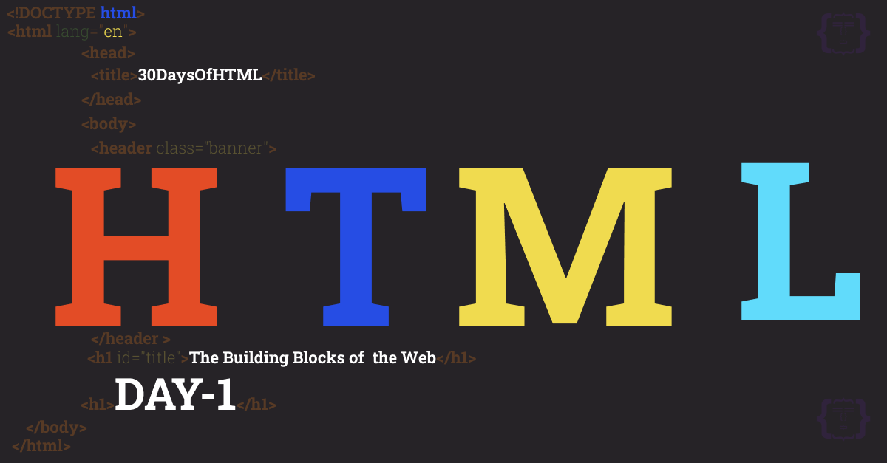
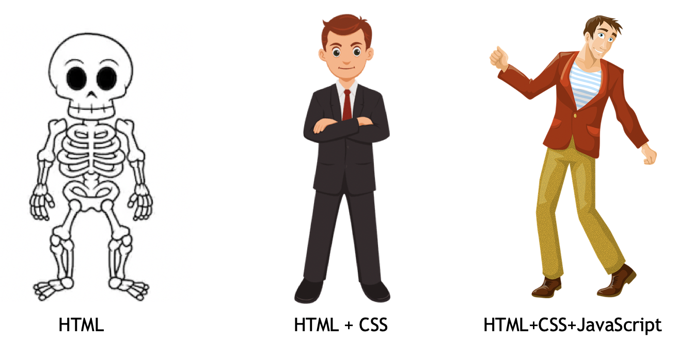
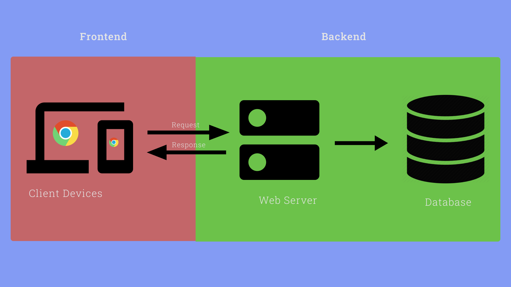
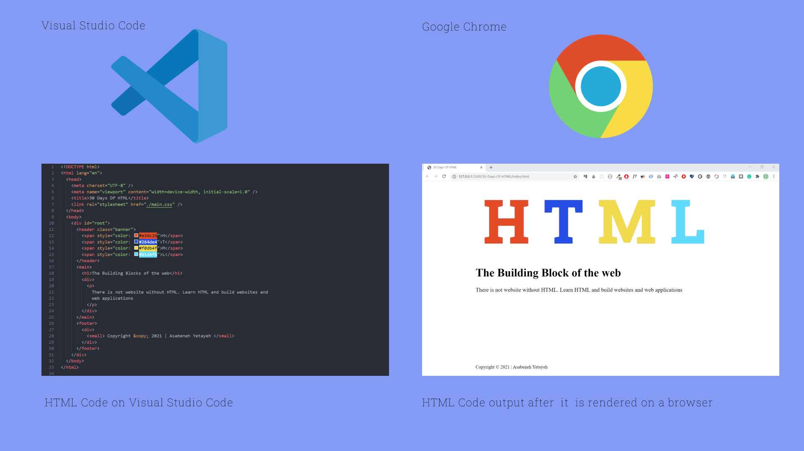
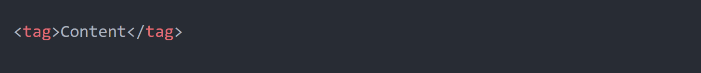
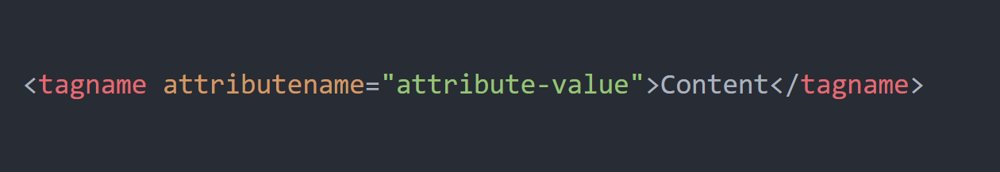
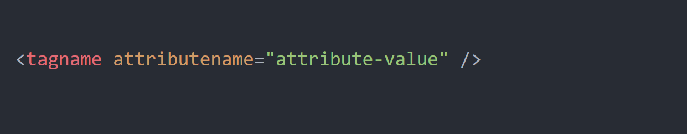
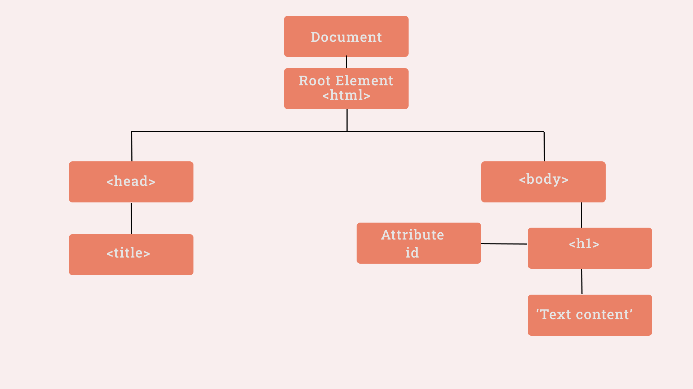
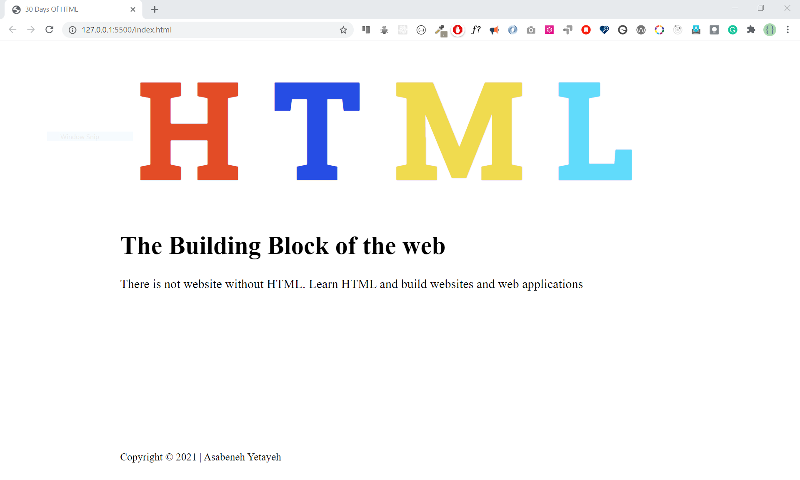
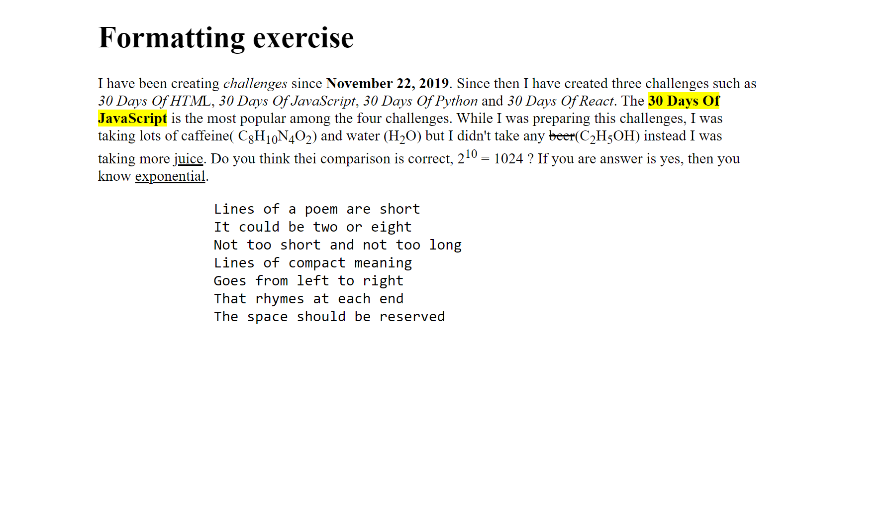

# 30 Days Of HTML

- [30 Days Of HTML](#30-days-of-html)
  - [Terminologies](#terminologies)
- [Day 1](#day-1)
  - [Introduction](#introduction)
  - [Requirements](#requirements)
  - [Web Development](#web-development)
    - [Frontend Web Development](#frontend-web-development)
    - [Backend Web Development](#backend-web-development)
    - [Full-stack Web Development](#full-stack-web-development)
  - [How the Web Works](#how-the-web-works)
  - [Web Development Tools](#web-development-tools)
  - [Parts of a website](#parts-of-a-website)
  - [Exercises](#exercises)
- [Day - 2](#day---2)
  - [Setting Development Environment](#setting-development-environment)
    - [Browser](#browser)
    - [Code Editor](#code-editor)
    - [How to use Visual Studio Code](#how-to-use-visual-studio-code)
  - [Introductin to HTML](#introductin-to-html)
    - [History of HTML](#history-of-html)
    - [What is HTML?](#what-is-html)
    - [HTML Element](#html-element)
    - [Attribute](#attribute)
    - [HTML Comment](#html-comment)
  - [Exercise](#exercise)
- [Day 3](#day-3)
  - [DOM](#dom)
    - [Declaration](#declaration)
    - [Root Element](#root-element)
    - [Heading Elements](#heading-elements)
    - [Paragraph Element](#paragraph-element)
    - [Section Element](#section-element)
    - [Header Section](#header-section)
    - [Main Section](#main-section)
    - [Footer Section](#footer-section)
    - [Inline Style](#inline-style)
  - [Exercise](#exercise-1)
- [Day 4](#day-4)
  - [Blocking and Non-blocking Elements](#blocking-and-non-blocking-elements)
  - [Exercises](#exercises-1)
- [Day 5](#day-5)
  - [HTML5 Formatting Elements](#html5-formatting-elements)
  - [Exercises](#exercises-2)
- [Day 6](#day-6)
  - [HTML5 Semantic Elements](#html5-semantic-elements)
- [Day 7](#day-7)
  - [HTML Form](#html-form)
- [Day 8](#day-8)
  - [Meta tags](#meta-tags)
- [Day 9](#day-9)
  - [HTML Table](#html-table)
- [Day 10](#day-10)
  - [Lists](#lists)
- [Day 11](#day-11)
  - [File Paths](#file-paths)

| # Day |             Topics             |
| ----- | :----------------------------: |
| 01    |   [Introduction](./readMemd)   |
| 02    | [DOM(Document Object Model)]() |
| 03    |              []()              |
| 04    |              []()              |

🧡🧡🧡 HAPPY CODING 🧡🧡🧡

<div>
<small>Support the <strong>author</strong> to create more educational materials</small> <br />  
<a href = "https://www.paypal.me/asabeneh"></a>
</div>

<div align="center">
  <h1> 30 Days Of HTML: Introduction</h1>
  <a class="header-badge" target="_blank" href="https://www.linkedin.com/in/asabeneh/">
  
  </a>
  <a class="header-badge" target="_blank" href="https://twitter.com/Asabeneh">
  
  </a>

<sub>Author:
<a href="https://www.linkedin.com/in/asabeneh/" target="_blank">Asabeneh Yetayeh</a><br>
<small> February, 2020</small>
</sub>

</div>
</div>

[Day 2 >>](./)



## Terminologies

Some of the terminologies you may come across in this challenge:
<small>
_client_, _server_, _web developer_, _web designer_, _UI_, _UX_, _web development_, _browser_, _code editor_, _command lines_, _Git_, _GitHub_, _Version Control_, _semantic_, _accessibility_, _responsiveness_, _compatibility_, _request_, _response_, _HTML_, _CSS_, _JavaScript_, _viewport_, _blocking element_, _non-blocking element_, _tag_, _opening tag_, _closing tag_, _self closing tag_, _attribute_, _style_, _script_, _property_, _value_, _render_, _comment_, _HTTP_, _path_, _URL_, _absolute path_, _relative path_, _landing page_, _single page application_, _hero image_, _HTML element_, _content_, _SEO_, _feature image_, _carousel_, _sidebar_, _website_, _web application_
</small>

# Day 1

## Introduction

Congratulations on deciding to participate in 30 days of HTML challenge. In this challenge you will learn everything you need to know about HTML, and in general, the foundation of web development. In the end of the challenge, you will get a 30DaysOfHTML challenge completion certificate. In case you need help or if you would like to help others you may join the [telegram group](https://t.me/ThirtyDaysOfHTML).

A 30DaysOfHTML challenge is a complete guide for both beginners and advanced developers. Welcome to 30DaysOfHTM! HTML is the build-block of the web. There is no website without HTML, therefore, to develop a website it requires an HTML.

In this step by step HTML challenge, you will learn HTML, the standard markup language for the web. HTML is used to build the skeleton or outline of any website. The skeleton or outline of the website is styled(beautified) by CSS(Cascading Style Sheet). JavaScript (JS) can make a website interactive and dynamic. HTML, CSS and JS are the core technologies to build websites and these are the skills required to be a web developer. This challenge will focus on HTML but we will use little CSS to make some HTML concepts more clear to the readers. A 30DaysOfCSS will be a follow up challenge after 30DaysOfHTML. There are [30 Days of JavaScript](https://github.com/Asabeneh/30-Days-Of-JavaScript), [30 Days of React](https://github.com/Asabeneh/30-Days-Of-React), and [30 Days of Python](https://github.com/Asabeneh/30-Days-Of-Python) by the same author.

Look at the following picture to understand the purpose of HTML, CSS and JavaScript very well.



The image has been taken from medium article, [source](https://medium.com/@readizo.com/html-basics-the-10-important-concepts-afeedcbe8e7d).

By the end of the challenge:

- You will have a clear understanding of how the web works
- You will be able to develop a modest static website with HTML and little CSS
- You will know what to do next to become a web developer

The main goal of this challenge is to teach the core building block of the web that is HTML. Therefore, let's get started by understanding some the terminologies in this field such as _web development_, _front end development_, _back end development_, and _full-stack_.

⚠️ This is not a proof read material. You may find typo, grammar and some technical errors here and there. The content will be updated now and then. Therefore, do not be surprised you find a typo or a grammar or other mistakes.

## Requirements

The minimum requirement to follow this challenge:

- Motivation
- Computer
- Internet

## Web Development

Web development is a process of designing, building, testing, and maintaining a website which ranges from a simple single page static website to a complex full-stack applications. This field has two broad categories.

- Frontend
- Backend

### Frontend Web Development

A front end(client-side) is a website that a user can see and interact with. It can be also called a client-side because it is the part that the user(client) can see and interact with. Therefore, anything we see on any website when we surf on the internet is part of the front end and it includes the colors, fonts, buttons, images, videos, audios and any other content on the website. The technologies that uses to build front end parts of a website are called front end technologies. The core technologies to build a front end are:

- HTML
- CSS
- JavaScript

There are hundreds of JavaScript that allows building a dynamic web applications. Currently, the three most popular JavaScript libraries are:

- React
- Vue
- Angular

Do not learn learn JavaScript before, HTML and CSS. Do not learn JavaScript libraries before you learn JavaScript. This the right sequence of learning:HTML > CSS > JavaScript > React or Vue or Angular.

### Backend Web Development

Backed(Server-side) development refers to the activities that happens behind the scene. Backend development consists of backend a programming language and a database. The backend interacts with frontend and the database using a backend programming language that could be (Node.js, Python, Ruby, PHP, etc). Look at the following figure to understand the interaction between client. A client send a HTTP request to the backend and the backend return a HTTP response to the client computer(The response could be an HTML page, txt, image, or any other form of data). HTTP(Hypertext Transfer Protocol) is a communication protocol that allow transmitting data between a client and a sever. It is designed for communication between web browsers(client) and web servers.



### Full-stack Web Development

Full-stack is another buzzword that no one agrees on the definition. You can understand Full-stack web development as a sum of frontend, backend, testing, and including some other technologies.
I believe now you have a big picture of web development.

## How the Web Works

By now you should have clear understanding how the web works based on the information you get on the above two sections. If you want to know more you may also read this [article](https://developer.mozilla.org/en-US/docs/Learn/Getting_started_with_the_web/How_the_Web_works).

## Web Development Tools

Tools you need as a web developer

- Motivation
- Computer
- Internet: To access information or resources
- Browser: allows to render HTML code to a human readable output(website pages). Examples of browsers(Chrome, Firefox, IE, Safari, Opera, Brave, etc)
- Design Software: allow to create a design or a prototype of the website. Examples of (Figma, Adobe XD, etc)
- Code Editor: allows to write code. For example(Visual Studio Code, Atom, Sublime Text, Bracket, etc)
- Git(Version Control Software): allows to manage different version of our code

Before we start developing a website, it is good to recall the common parts(components) of a website. In the next section, we will cover this.

## Parts of a website

A website can have a couple of features or several features. There is no guideline that tells what a website should have but most of the time a website has the following common parts(components). For instance, if you look at the [first ever created website](http://info.cern.ch/hypertext/WWW/TheProject.html), it has just one page and several links. However, since 1993 to today, for the last three decades HTML has been evolving and with only HTML it is possible to develop a decent static website.

Let's see the most common parts(components) of a website:

- Website Logo
- Header/Banner
- Navigation Bar/Menu Bar
- Carousel
- Sections
- Forms
- Buttons
- Links
- Images
- Videos
- Audios
- Social Links
- Footer

If you agree that these are components of a website, then you will create these components to build a website. Actually, once you create a certain feature it can be used in different projects(reusable). Therefore, whenever you create a certain part try to consider maintainability and reusability.
You don't have to have all the mentioned above features when you develop a website. There is no strict guidelines what to have on your website.

## Exercises

1. What is web development?
2. What is frontend?
3. Mention at least four frontend technologies
4. What is backend?
5. Mention at least four backend technologies
6. What is full-stack
7. What is client?
8. What is server
9. What is HTTP?
10. What is HTTP request ?
11. What is HTTP response?
12. What are the necessary tools for a web development?
13. Mention parts of a website
14. What is the purpose of HTML
15. What is the purpose of CSS?
16. What is the purpose of JavaScript
17. Is it possible to develop using only HTML?
18. Is there any strict guidelines what a website should look like?
19. What are Git and GitHub? Did you install Git? Do you have GitHub account?
20. Do you need a prototype or mockup or a wireframe before you start building the website?
21. First open this [website](http://info.cern.ch/hypertext/WWW/TheProject.html), then right click on the page then click source, after that you will get an HTML source code. Count the number of the different HTML tag that have been used on this site.

# Day - 2

## Setting Development Environment

### Browser

There are many browsers out there but most developers prefer to use Google Chrome or FireFox. I usually use Google chrome for development and I recommend it too. [Download](https://www.google.com/chrome/) Google Chrome if you do not have one.

The browser render your HTML code to a human read website.

### Code Editor

As web developer, you should write code using a text or code editor. Therefore, to write HTML code, CSS, JS, React or other you need to have a code edit.

I will use Visual studio code and I will use it in this challenge too. I strongly suggest to use Visual Studio Code because it has lots of productivity extensions that makes super productive. Now, let's [download](https://code.visualstudio.com/) visual studio code.

### How to use Visual Studio Code

## Introductin to HTML

### History of HTML

The initial release of HTML was 1993. The first version of HTML was written by Tim Berners-Lee in 1993. HTML has been evolving for the last three decades and the now the latest version is HTML5.

### What is HTML?

The word HTML is an acronym. That is stands for Hypertext Markup Language. It is the standard markup languages to develop websites. HTML is the build block of the web that allows building layouts of page using HTML elements. HTML is not not a programming language instead it is a markup language.

HTML code will be rendered by a browser and it give a human readable output. Look at the figure bellow to understand better how the HTML code convert to a website using a browser.



### HTML Element

HTML elements consists of an open tag(<>), attribute(s), content and closing tag(<>).
Look at the figure below to understand a syntax of an HTML element.



```html
<h1>Welcome to 30 Days of HTML</h1>
```

The tag name is _h1_ and the content is _30 Days of HTML_. The h1 will tell the browser to make the text a big font size that why we call HTML a markup language.

```html
<p>
  HTML elements are the blocking of a website. There is not website without
  HTML. Learn HTML and build a website.
</p>
```

The _p_ tag marks the text to be paragraph that why we call HTML a markup language.

### Attribute

HTML attributes provide additional information about the element. An attribute can added only in the opening tag. It will be difficult to list down all HTML attributes but we can list down the most common ones.

- alt - to add information about added image, use with _img_ element.
- autocompelete - to enable auto complete feature of a form, use with form and input.
- autofocus - enable auto focus of input fields
- autoplay - allows playing an audio/video on the page loads
- charset - enable character encoding of meta tag
- checked - to make a checkbox checked of an input element
- class - to give a common identifier for HTML elements
- cols - to determine the width of a textarea element
- contenteditable - make any element editable
- download - allows a link to download a resource(image, pdf, PPT, etc)
- draggable - to make an element draggable, apply to all elements
- for - to connect/bound a label element with a specific input field, use with a label tag
- href - to specify a URL or a path of a resource, use with a link tag
- id - a unique id for an HTML element, apply to all elements
- lang - specifies the language of the page
- type - specifies the type of the element and it uses with only a certain elements
- src - to specify URL of a media file(img, audio, video, source, embed, script)
- style - to add an inline CSS style to an element

There are also event listener attribute that listen mouse or keyboard. For instance, onclick, onsubmit, onkeydown, onkeyup, onscroll, etc. Remember, do not try to remember by hard. For detail information about, HTML attributes you may check this [link](https://www.w3schools.com/tags/ref_attributes.asp)


An attribute is optional in an HTML element. See the following h1 tag with an id attribute value of _first-title_.

```html
<h1 id="first-title">Welcome to 30 Days of HTML</h1>
```

An HTML element with multiple attributes

```html
<h1 id="first-title" class="title">Welcome to 30 Days of HTML</h1>
```

```html
<p style="color:gray;">
  HTML elements are the blocking of a website. There is not website without
  HTML. Learn HTML and build a website.
</p>
```

The above _p_ tag has a style attribute. The style attribute has a color property and a value gray. The style changes the text color to gray. You can try it by adding other property and value in the style. Each value has to be separated by a semicolon.

Some HTML elements do not have closing tag, instead they have self-closing tag.


An example of self closing tags:

```html
<area />
<base />
<br />
<col />
<embed />
<hr />

<input />
<link />
<meta />
<para />
<source />
<track />
<wbr />
```

The slash is optional but I strongly recommend to use the slash with self-closing tags. For instance, React.js does not allow you to use without the slash.

### HTML Comment

Comment in any programming language help a code to be more readable. Therefore, it is common to leave some text on a code to make it more readable and maintainable. Let us the syntax of an HTML comment, it has opening (<!--) and closing(-->)

```html
<!-- The is an HTML comment and it makes the code more readable -->
```

## Exercise

1. What is the acronym HTML stands for?
2. What is an HTML element?
3. What is an attribute
4. Write at least five HTML attributes
5. Where do you write an attribute to HTML element?
6. Write an HTML comment that says, I am enjoying 30 Days of HTML
7. What is the purpose of Visual studio code?
8. What is the purpose of the browser?
9. Does every element need to have attributes?

# Day 3

## DOM

In this section, we will start writing the DOM tree of an HTML document or file. DOM stands for Document Object Model. The DOM is structure like a true. It starts with an _html_ root element followed by head and body. The head and the body are the immediate children of the root element, _html_. Before the root element, there is a declaration.

### Declaration

Before the root element, there is a declaration. This declaration tells the browser that the document is an HTML. Therefore, the browser render it to the way an HTML suppose to be rendered.
This is the code to declare an HTML. The declaration is not part of the DOM tree.

```html
<!DOCTYPE html>
```

### Root Element

The _html_ element is the root of the DOM tree and is the parent of _head_ and _body_.

The DOM try has be wrapped by the html tag.

```html
<!DOCTYPE html>
<html></html>
```

The _html_ tag with two children, head and body.

```html
<!DOCTYPE html>
<html>
  <head></head>
  <body>
    content goes here
  </body>
</html>
```

Create folder on the desktop and give it any name and even you may call it (30DaysOfHTML), inside this folder create an index.html file. Every HTML file has to end with a .html extension. And it is good to have at least on index.html file in the a project and the reset of the file will have different names.

This a simplistic DOM structure that contains _html_, _head_, _title_, _body_, _h1_ elements.

```html
<!DOCTYPE html>
<html>
  <head>
    <title>30 Days Of HTML</title>
  </head>
  <body>
    <h1 id="first-title">The Building Blocks of the web</h1>
  </body>
</html>
```

The DOM tree of the above HTML looks like the following diagram.



### Heading Elements

HTML is a markup language. We mark a content using an HTML tag and the browser render it to a clean web page. The h1 tag means making a text to be a large font size text, by default it creates 32px size text. We have h1 to h6 different tags to write different font size title. Pixel(px) is a unit to measure size which is as small as a dot.

```html
<!DOCTYPE html>
<html>
  <head>
    <title>30 Days Of HTML</title>
  </head>
  <body>
    <h1>First level heading</h1>
    <h2>Second level heading</h2>
    <h3>Third level heading</h3>
    <h1>Fourth level heading</h1>
    <h4>Fifth level heading</h4>
    <h6>Sixth level heading</h6>
  </body>
</html>
```

The size of the h1 to h6 tags:

- h1 is 32px (2em)
- h2 is 24px (1.5em)
- h3 is 20.8px (1.3em)
- h4 is 16px (1em)
- h5 is 12.8px (0.8em)
- h6 is 11.2px (0.7em)

### Paragraph Element

Now, let's add paragraph to our web page using the _p_ tag.

```html
<!DOCTYPE html>
<html>
  <head>
    <title>30 Days Of HTML</title>
  </head>
  <body>
    <h1 id="first-title">The Building Blocks of the web</h1>
    <p>
      There is not website without HTML. Learn HTML and build websites and web
      applications
    </p>
  </body>
</html>
```

Now, there are six elements in the above HTML code. An HTML element may have a parent, a child, sibling(s). The _html_ element is the root or the parent of the _head_ and _body_. The _head_ and _body_ are children of the _html_ tag.The _head_ and _body_ are siblings. The _title_ is the child of the _head_. The body has two children, the h1 and p.

### Section Element

If we went to create section for our page, we can use div or section element. Section element has semantic meaning.
Let's add div in the previous page.

```html
<!DOCTYPE html>
<html>
  <head>
    <title>30 Days Of HTML</title>
  </head>
  <body>
    <div>
      <h1 id="first-title">The Building Blocks of the web</h1>
      <p>
        There is not website without HTML. Learn HTML and build websites and web
        applications
      </p>
    </div>
  </body>
</html>
```

As you can see from the above code, all the elements inside the body are wrapped by a div.
Instead of div, a section can be also used

```html
<!DOCTYPE html>
<html>
  <head>
    <title>30 Days Of HTML</title>
  </head>
  <body>
    <section>
      <h1 id="first-title">The Building Blocks of the web</h1>
      <p>
        There is not website without HTML. Learn HTML and build websites and web
        applications
      </p>
    </section>
  </body>
</html>
```

### Header Section

Now, let us add header to our web page using the _header_ HTML tag.

```html
<!DOCTYPE html>
<html>
  <head>
    <title>30 Days Of HTML</title>
  </head>
  <body>
    <header>HTML</header>
    <section>
      <h1 id="first-title">The Building Blocks of the web</h1>
      <p>
        There is not website without HTML. Learn HTML and build websites and web
        applications
      </p>
    </section>
  </body>
</html>
```

In side the header, we can add any kind of HTML element. But I like to style the four letters of the HTML text. Therefore, I have to tag them in _span_ element.

```html
<!DOCTYPE html>
<html>
  <head>
    <title>30 Days Of HTML</title>
  </head>
  <body>
    <header>
      <span>H</span>
      <span>T</span>
      <span>M</span>
      <span>L</span>
    </header>
    <section>
      <h1 id="first-title">The Building Blocks of the web</h1>
      <p>
        There is not website without HTML. Learn HTML and build websites and web
        applications
      </p>
    </section>
  </body>
</html>
```

### Main Section

Let's make use of the _main_ HTML tag to wrap all the content that will go to the main section.

```html
<!DOCTYPE html>
<html>
  <head>
    <title>30 Days Of HTML</title>
  </head>
  <body>
    <header>
      <span>H</span>
      <span>T</span>
      <span>M</span>
      <span>L</span>
    </header>
    <main>
      <section>
        <h1 id="first-title">The Building Blocks of the web</h1>
        <p>
          There is not website without HTML. Learn HTML and build websites and
          web applications
        </p>
      </section>
    </main>
  </body>
</html>
```

### Footer Section

There is a _footer_ HTML tag to make a footer. Let us create footer for the web page.

```html
<!DOCTYPE html>
<html>
  <head>
    <title>30 Days Of HTML</title>
  </head>
  <body>
    <header>
      <span>H</span>
      <span>T</span>
      <span>M</span>
      <span>L</span>
    </header>
    <main>
      <section>
        <h1 id="first-title">The Building Blocks of the web</h1>
        <p>
          There is not website without HTML. Learn HTML and build websites and
          web applications
        </p>
      </section>
    </main>
    <footer>Copyright 2021 | Asabeneh Yetayeh</footer>
  </body>
</html>
```

Instead of just throwing text in the footer tag let us add a _small_ HTML tag to wrap the text and it will be render to a small size text.

```html
<!DOCTYPE html>
<html>
  <head>
    <title>30 Days Of HTML</title>
  </head>
  <body>
    <header>
      <span>H</span>
      <span>T</span>
      <span>M</span>
      <span>L</span>
    </header>
    <main>
      <section>
        <h1 id="first-title">The Building Blocks of the web</h1>
        <p>
          There is not website without HTML. Learn HTML and build websites and
          web applications
        </p>
      </section>
    </main>
    <footer>
      <small>Copyright 2021 | Asabeneh Yetayeh</small>
    </footer>
  </body>
</html>
```

### Inline Style

We can apply CSS to an HTML element using inline styling.
Look at the figure below


We use the _style_ attribute to apply CSS to an HTML element.
For instance, let us apply style to h1.

```html
<h1 id="first-title" style="color:green">The Building Blocks of the web</h1>
```

We can add more CSS properties by separating with semicolons

```html
<h1 id="first-title" style="color:green;font-size:90px; background:blue;">
  The Building Blocks of the web
</h1>
```

As you can see from above code, _font-size_ and _background_ properties have been used.

Similarly let us apply style to the _span_ elements.

```html
<!DOCTYPE html>
<html>
  <head>
    <title>30 Days Of HTML</title>
  </head>
  <body>
    <header>
      <span style="color: #e34c26">H</span>
      <span style="color: #264de4">T</span>
      <span style="color: #f0db4f">M</span>
      <span style="color: #61dbfb">L</span>
    </header>
    <main>
      <section>
        <h1 id="first-title">The Building Blocks of the web</h1>
        <p>
          There is not website without HTML. Learn HTML and build websites and
          web applications
        </p>
      </section>
    </main>
    <footer>
      <small>Copyright 2021 | Asabeneh Yetayeh</small>
    </footer>
  </body>
</html>
```

Colors can be described by name, hexadecimal, RGB(Red, Green, Blue), and HSL(Hue, Saturation, Lightness).

There about 1.67 million colors and it hard to describe them by name. There are about 140 colors that can be described by name and the rest of the colors can be described using hexadecimal, RGB, or HSL. One form of the color can be converted the other.
Let see the different form of the color red(name), hexadecimal(#ff0000), RGB(rgb(255, 0, 0)) and HSL(hsl(0, 100%, 50%))

If you followed all the steps by now you should get something like this.



Congratulations! You have completed Day 3 challenge

## Exercise

Make a DOM tree of the following HTML code

```html
<!DOCTYPE html>
<html>
  <head>
    <title>30 Days Of HTML</title>
  </head>
  <body>
    <header>
      <span style="color: #e34c26">H</span>
      <span style="color: #264de4">T</span>
      <span style="color: #f0db4f">M</span>
      <span style="color: #61dbfb">L</span>
    </header>
    <main>
      <section>
        <h1 id="first-title">The Building Blocks of the web</h1>
        <p>
          There is not website without HTML. Learn HTML and build websites and
          web applications
        </p>
      </section>
    </main>
    <footer>
      <small>Copyright 2021 | Asabeneh Yetayeh</small>
    </footer>
  </body>
</html>
```

# Day 4

## Blocking and Non-blocking Elements

HTML elements are like a box. Some elements take the whole width of the view port while some take as much space that fit only for the content. In another way, some elements do not allow other elements to come next them both in the left and right side, however, some elements allow other elements to come next to them.

- Blocking elements take the whole width of the viewport.
- Non-blocking element only take a space that is enough for the content.

List of blocking elements:

```sh
<address>
<article>
<aside>
<blockquote>
<canvas>
<dd>
<div>
<dl>
<dt>
<fieldset>
<figcaption>
<figure>
<footer>
<form>
<h1>-<h6>
<header>
<hr>
<li>
<main>
<nav>
<noscript>
<ol>
<p>
<pre>
<section>
<table>
<tfoot>
<ul>
<video>
```

List of non-blocking elements

```sh
<a>
<abbr>
<acronym>
<b>
<bdo>
<big>
<br>
<button>
<cite>
<code>
<dfn>
<em>
<i>

<input>
<kbd>
<label>
<map>
<object>
<output>
<q>
<samp>
<script>
<select>
<small>
<span>
<strong>
<sub>
<sup>
<textarea>
<time>
<tt>
<var>
```

To create a new line between non-blocking elements we can use the break(br) element.

## Exercises

1. What is blocking element?
2. What is non-blocking element?
3. What is the difference between block and non-blocking elements?
4. List at least five blocking elements
5. List at least five non-blocking elements

# Day 5

## HTML5 Formatting Elements

We format text in different form on daily basis. Every Microsoft office users know how to format a text on Microsoft office document. Similarly, we can format text on a web using different HTML elements.

HTML Formatting Elements

```sh
- <b> - Create bold text
- <strong> - Make an important text
- <i> -  Make italic text
- <em> -  Make emphases to text
- <mark> - Marks text
- <small> - Make smaller text
- <del> - Deleted text
- <ins> - Inserted text
- <sub> - Subscript text
- <sup> - Superscript text
- <pre> - Preserve text space
- <u> -To underline
```

I want to be <b>bold Text </b>  
I am very <strong>important text </strong>  
I want to be <i>an italic text </i>  
I am <em>emphasized text </em>  
I am <mark> marked text </mark>  
I am <small>a smaller text </small>  
I am <del> deleted text </del>  
My favorite language is not <del>Python</del>. It is <ins>JavaScript</ins>  
2H<sub>2</sub> + O<sub>2</sub> = 2H<sub>2</sub> O<sub></sub>
2<sup>10</sup> = 1024  

<pre>I like to make break her
I like to start a new line
This is the third line. The pre tag is 
good to use when a space is need to be
preserved for instance for poem.</pre>
<u>I am underlined</u>

## Exercises

Create the following text using the formatting elements.


# Day 6

## HTML5 Semantic Elements

# Day 7

## HTML Form

# Day 8

## Meta tags

# Day 9

## HTML Table

# Day 10

## Lists

# Day 11

## File Paths
